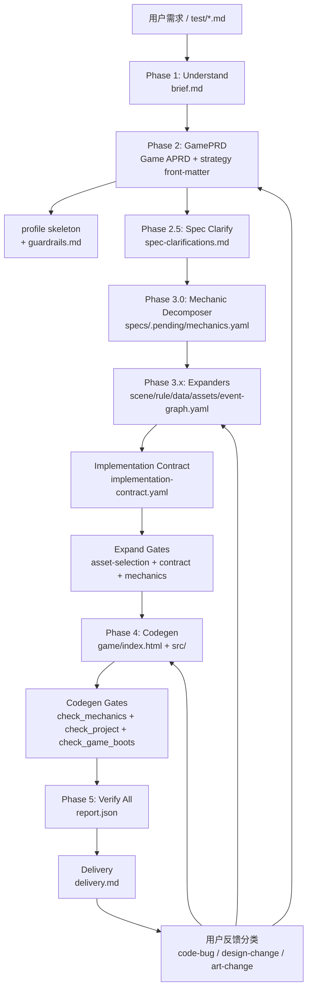

# 当前游戏生成链路流程框架报告

生成日期：2026-04-26
仓库：`/Users/bytedance/Project/game_skill`

## 1. 总结

当前链路已经从早期“PRD 直接生成代码、靠 Phase 5 测试兜底”的模式，升级为一条带中间规格、机制原语、资产策略、实现契约和冻结校验的串行流水线：

```text
Phase 1 Understand
  -> Phase 2 GamePRD + Strategy 回写
  -> Phase 2.5 Spec Clarify
  -> Phase 3 Expand
       3.0 mechanic-decomposer
       3.x scene/rule/data/assets/event-graph 并发展开
       3.5 implementation-contract + gates + check_mechanics
  -> Phase 4 Codegen
  -> Phase 5 Verify + Deliver
  -> 用户反馈分类后局部或全链路重跑
```

这条链路的核心思想是：让自然语言需求先落成机器可读的 Game APRD，再把玩法拆成 `mechanics.yaml` 原语 DAG，把场景、规则、数据、资产、事件图拆成 YAML，把 Expand 到 Codegen 的要求收束为 `implementation-contract.yaml`。最后代码生成和验证都围绕这些工件执行，而不是让 LLM 在后期测试失败后自由补丁式修复。

## 2. 总体架构图



## 3. 目录和状态约定

所有 case 产物必须写在 `cases/{project-slug}/` 下，避免多个项目互相覆盖：

```text
cases/{project-slug}/
├── docs/
│   ├── brief.md
│   ├── game-prd.md
│   ├── spec-clarifications.md
│   └── delivery.md
├── specs/
│   ├── mechanics.yaml
│   ├── scene.yaml
│   ├── rule.yaml
│   ├── data.yaml
│   ├── assets.yaml
│   ├── event-graph.yaml
│   └── implementation-contract.yaml
├── game/
│   ├── index.html
│   └── src/
├── eval/
│   └── report.json
└── .game/
    ├── state.json
    ├── log.jsonl
    ├── guardrails.md
    └── freeze.json
```

`state.json` 由 `game_skill/skills/scripts/_state.js` 统一读写，schema 版本为 `schemaVersion: 1`。状态阶段包括 `understand / prd / expand / codegen / verify`，其中 expand 细分为 `mechanics / scene / rule / data / assets / event-graph / implementation-contract` 七个子任务。

`.game/log.jsonl` 是全链路日志，校验脚本通过 `--log` 写入，修复循环在改代码前必须追加 `fix-applied` 记录。

## 4. Phase 1: Understand

输入是用户自然语言、`test/*.md` 或上传素材。输出是 `docs/brief.md`，结构包含：

- `Raw Query`：原始需求逐字留档。
- `Inferred`：推断出的类型、平台、模式、交互、资源提示、是否 3D。
- `Gaps`：未确认的需求缺口。
- `ClarifiedBrief`：经过澄清或默认决策后的可执行 brief。

本阶段解决产品边界问题，不追问机制细节。重点规则：

- 短 query、必填字段不清、功能优先级不清时必须触发澄清。
- 所有澄清问题都要提供“让我决定”选项，允许用户授权默认决策。
- `is-3d` 默认 `false`；只有明确 3D、Three.js、第一人称、3D 模型等信号时才置为 `true`。
- Phase 1 末尾要确认引擎，2D 候选为 `phaser3 / pixijs / canvas / dom-ui`，3D 只允许 `three`。

## 5. Phase 2: GamePRD + Strategy

Phase 2 产出 `docs/game-prd.md`，它是整个链路的唯一事实源。格式是 Game APRD：front-matter + `@game / @scene / @rule / @entity / @constraint / @check` 等结构化 tag。

Phase 2 末尾的 Strategy 不是独立阶段，而是在 PRD front-matter 回写：

- `delivery-target`
- `must-have-features`
- `nice-to-have-features`
- `support-level`
- `engine-plan`
- `mvp-scope`
- `risk-note`
- `asset-strategy`
- `color-scheme`

关键门禁：

- `check_game_prd.js` 必须通过。
- `@rule.effect` 必须是伪代码风格，不能是散文化描述。
- `runtime` 必须来自 `references/engines/_index.json`。
- `is-3d=true` 必须搭配 `runtime: three`；`is-3d=false` 禁止选 `three`。
- `asset-strategy.rationale` 至少 80 字，并且 `visual-core-entities` 必须引用 PRD 中真实存在的 `@entity/@ui`。

Phase 2 还会自动生成两个后续关键产物：

- `game_skill/skills/scripts/profiles/{PROJECT}.skeleton.json`：从 `@check(layer: product)` 和 hard-rule 生成 profile skeleton。
- `cases/{PROJECT}/.game/guardrails.md`：抽取 must-have、hard-rule、核心 rule，防止 codegen / verify 因上下文压缩丢约束。

## 6. Phase 2.5: Spec Clarify

输出是 `docs/spec-clarifications.md`。它在 PRD 通过后、Expand 前运行，只处理功能机制歧义：

- `trigger`：规则什么时候触发。
- `condition`：哪些状态满足才生效。
- `effect`：一次触发改变什么状态。
- `target-selection`：目标选择范围和优先级。
- `timing/order`：同 tick 多规则结算顺序。
- `resource/lifecycle`：资源消耗、回收、生成、销毁时机。
- `movement/collision`：移动粒度、碰撞优先级。

如果歧义会改变核心玩法，最多问 1-2 个问题；如果不阻塞核心玩法，则记录保守默认假设。该文件是 Phase 3 的必读输入，缺失时不得进入 Expand。

## 7. Phase 3: Expand

Phase 3 的目标是把 PRD 编译成实现前的中间规格，而不是让 Codegen 直接读散文 PRD。

### 7.1 Phase 3.0 Mechanic Decomposition

`game-mechanic-decomposer` 读取 `game-prd.md`、`spec-clarifications.md` 和 mechanic primitive catalog，输出 `specs/.pending/mechanics.yaml`。

`mechanics.yaml` 是玩法真值层，包含：

- entities 初始字段。
- mechanics primitive DAG。
- hard-rule 到 primitive 字段或 invariant 的映射。
- unmapped PRD 文本。
- simulation scenarios，至少一条能到达 win。

当前 Stage 1 原语库包含 10 个正交 primitive：

- motion：`parametric-track`、`grid-step`
- spatial：`grid-board`、`ray-cast`、`neighbor-query`
- logic：`predicate-match`、`resource-consume`、`fsm-transition`
- progression：`win-lose-check`、`score-accum`

这一步是目前链路最重要的前置改造：把“玩法是否结构性成立”的判断前移到 Phase 3，而不是等 Phase 5 靠 Playwright trace 发现。

### 7.2 Phase 3.x Five Expanders

`game-gameplay-expander` 按维度并发生成：

- `scene.yaml`：场景布局、交互热区、UI slots、boot-contract。
- `rule.yaml`：每条 rule 的 trigger / condition / effect-on-true / effect-on-false，且必须引用 mechanics node。
- `data.yaml`：资源 schema、示例数据、balance-check。
- `assets.yaml`：资源选择、local-file / generated 分档、selection-report。
- `event-graph.yaml`：inputEvent -> outputEvent 的事件连接蓝图、async-boundaries、test-hooks。

事务语义是先写 `specs/.pending/`，全部成功后一次性提交到 `specs/`。任一子任务失败，整个 Phase 3 failed，禁止让 Codegen 使用部分产物。

### 7.3 Implementation Contract

五份 expander 产物完成后，主 agent 调用：

```bash
node game_skill/skills/scripts/generate_implementation_contract.js cases/${PROJECT}/ \
  --out specs/.pending/implementation-contract.yaml
```

`implementation-contract.yaml` 是 Expand -> Codegen 的硬契约，主要包含：

- `runtime`：engine 与 run-mode。
- `boot`：入口 scene、ready condition、start action、scene transitions。
- `asset-bindings`：素材绑定到哪个 UI/实体、是否必须渲染、是否允许 fallback。
- `engine-lifecycle`：如 Phaser 必须在 `preload()` 阶段注册素材。
- `verification`：report 只能引用 verifier 产出的证据。

### 7.4 Expand Gates

Phase 3 原子提交后必须立即运行：

```bash
node game_skill/skills/scripts/check_asset_selection.js cases/${PROJECT}/ --log ${LOG_FILE}
node game_skill/skills/scripts/check_implementation_contract.js cases/${PROJECT}/ --stage expand --log ${LOG_FILE}
node game_skill/skills/scripts/check_mechanics.js cases/${PROJECT}/ --log ${LOG_FILE}
```

这些 gate 主要拦截：

- 素材库选型错误、风格/genre 不匹配、local-file 占比不足。
- 色块/目标块被错误绑定成 coin、tile、button 等具象素材。
- boot scene / start-action / transition 指向不存在的 scene 或 zone。
- hard-rule 没有映射到 mechanics invariant。
- mechanics DAG 无法完成至少一个 win scenario。

## 8. Phase 4: Codegen

输出是 `game/index.html` 和可选 `game/src/`。所有工程必须满足：

- 零 npm install、零构建步骤。
- `index.html` head 必须写 `<!-- ENGINE: {runtime} | VERSION: ... | RUN: {file|local-http} -->`。
- `window.gameState` 必须暴露。
- 真实 UI 输入必须能触发逻辑，不能只靠 `window.gameTest`。
- 每个 `mechanics.yaml` node 必须在代码中有 `@primitive(...)` 实现注释。
- 每条 `@constraint(kind: hard-rule)` 必须有 `@hard-rule(...)` 注释落点。
- required local-file 不能只出现在 manifest，必须在业务代码中真实消费。

Codegen 的核心输入优先级是：

```text
mechanics.yaml + implementation-contract.yaml
  > specs/*.yaml
  > docs/game-prd.md
  > 引擎 guide/template
```

当前支持的引擎和默认 run-mode：

| runtime | 默认 run-mode | 适合场景 |
|---|---|---|
| `dom-ui` | `file` | 教育练习、问答、剧情互动 |
| `canvas` | `file` | 规则清晰的网格、问答、轻量 2D |
| `phaser3` | `local-http` | 控制闯关、物理、棋盘动画、反应型 |
| `pixijs` | `local-http` | 棋盘格子、消除、粒子视觉 |
| `three` | `local-http` | 明确 3D / Three.js / 第一人称 / 3D 模型 |

Codegen 完成后必须运行：

```bash
node game_skill/skills/scripts/check_mechanics.js cases/${PROJECT}
node game_skill/skills/scripts/check_project.js cases/${PROJECT}/game/ --log ${LOG_FILE}
node game_skill/skills/scripts/check_game_boots.js cases/${PROJECT}/game/ --log ${LOG_FILE}
```

`check_project.js` 会链式覆盖 implementation-contract、asset-selection、asset-usage、asset-paths 等工程门槛。

## 9. Phase 5: Verify + Deliver

正式交付只能通过统一入口：

```bash
node game_skill/skills/scripts/verify_all.js cases/${PROJECT} --profile ${PROJECT} --log ${LOG_FILE}
```

`verify_all.js` 顺序运行：

1. `check_mechanics.js`
2. `check_game_boots.js`
3. `check_project.js`
4. `check_playthrough.js`
5. `check_skill_compliance.js`

任一失败，`eval/report.json` 必须是 failed。任何 agent 或人工流程都不能手写绿色 report。

Phase 5 还增加了两类冻结：

- `_profile_guard.js --freeze`：冻结正式 profile SHA，防止修复循环中改宽测试。
- `freeze_specs.js`：冻结 `docs/game-prd.md` 和 `specs/`，修复循环每轮都要 `--verify`。如果 PRD/specs 被改，立即终止，不能在 Phase 5 里“改规格来过测试”。

最终输出：

- `eval/report.json`：由真实脚本退出码聚合。
- `docs/delivery.md`：简洁说明运行方式、已交付功能、降级/延后功能、已知限制和评估结果。

## 10. 用户反馈后的重跑路径

交付后用户反馈先由 `prd_diff.js --classify` 分成四类：

| 类型 | 典型反馈 | 重跑路径 |
|---|---|---|
| `code-bug` | 白屏、没反应、console error、点击无效 | 只走 Phase 5 修复循环，不碰 PRD/specs |
| `design-change` | 太难、想改玩法、关卡数、胜负条件 | Phase 2 -> Phase 3 -> Phase 4 -> Phase 5 |
| `art-change` | 风格、配色、换素材、动画效果 | 重跑 Phase 3.assets + implementation-contract + Phase 4 + Phase 5 |
| `ambiguous` | 描述不清 | 先 AskUserQuestion，含“让我决定”选项 |

这能避免把所有反馈都当作代码 bug 小修，导致规则、素材和代码长期不同步。

## 11. 当前链路的关键进步

### 11.1 玩法真值前置

`mechanics.yaml` + `check_mechanics.js` 把玩法结构判断放到 Phase 3.5。典型问题如“棋盘外圈轨道不应是圆形 ring”“ray-cast 必须从 source.gridPosition 起步”“至少一个 win scenario 可达”，不再等到生成后靠 UI 测试追问题。

### 11.2 Asset Strategy 从文档变成门禁

`asset-strategy` 现在影响 `check_asset_selection / check_asset_usage / check_implementation_contract`。`mode=none`、`generated-only`、`library-first` 有不同 gate 行为，且核心实体必须有素材或程序化视觉证据。

### 11.3 Expand -> Codegen 有硬契约

`implementation-contract.yaml` 把 boot、asset-bindings、生命周期、验证证据收束成机器契约。Codegen 不应再自由解释素材和启动方式。

### 11.4 最终报告不能手写漂绿

`verify_all.js` 是 `eval/report.json` 的唯一入口。report 的状态来自真实 check 脚本退出码，而不是 LLM 自己总结。

### 11.5 Phase 5 防止“面向测试改规格”

profile freeze 和 specs freeze 让修复循环只修实现代码。PRD 或 specs 真有问题时，必须回到上游阶段重跑。

## 12. 仍需关注的风险

### 12.1 主流程复杂度高，依赖 agent 严格执行

很多约束写在 `SKILL.md`、agent prompt 和 Markdown SOP 中，脚本只覆盖其中一部分。主 agent 如果漏跑某个脚本、漏解析子 agent JSON、或在失败时继续往下走，链路仍可能漂移。

建议：把 Phase 调度做成一个统一 runner，把“必须跑哪些脚本、哪些退出码阻断”从文档约束下沉到可执行编排。

### 12.2 Profile 仍放在全局脚本目录

当前 profile 生成路径仍是 `game_skill/skills/scripts/profiles/{PROJECT}.json`。虽然有 `_profile_guard.js`，但从长期工程隔离看，case-local profile 会更安全。

建议：后续迁移到 `cases/{PROJECT}/eval/profile.json`，全局目录只保留模板和基准 profile。

### 12.3 Codegen 的语义实现仍需要更强静态证据

`@primitive(...)` 注释能检查“有实现落点”，但不能完全证明实现逻辑与 primitive reducer 一致。`check_mechanics.js` 证明的是 specs 的可执行性，`check_project.js` 证明的是代码中有某些结构证据，中间仍有“实现与 primitive 行为不一致”的空间。

建议：逐步为高频 primitive 增加代码侧模式检查或小型 runtime probe，比如 `ray-cast(grid)` 的真实点击场景、`rect-loop` 的四边可视覆盖、resource-consume 的 before/after 字段变化。

### 12.4 Asset catalog 覆盖决定了 library-first 的上限

素材策略越严格，越依赖 `assets/library_2d/catalog.yaml` 和 `assets/library_3d/catalog.yaml` 的语义标注质量。如果 catalog 语义缺口大，expander 会频繁 fallback 到 generated，或者误选视觉不匹配资源。

建议：继续补 `semantic-hints`、style/genre preferred packs、color-block 例外规则，并把常见玩法实体沉淀成 catalog 可检索语义。

### 12.5 End-to-end 新链路样本仍需要固定基准

单个脚本和局部门禁已经增强，但最能证明链路稳定性的仍是一批从 Phase 1 到 Phase 5 完整生成的 benchmark cases。

建议：选 3 个固定样本做回归：

- `edu-practice + dom-ui/canvas`
- `board-grid + pixijs/phaser3`
- `pixel-flow 类复杂机制 + canvas/phaser3/pixijs`

每次改链路后跑同批样本，对比通过率、修复轮数、report 状态和用户可玩性。

## 13. 源文件索引

本报告根据当前仓库中的以下文件梳理：

| 文件 | 作用 |
|---|---|
| `game_skill/skills/SKILL.md` | 主链路入口，定义 Phase 1-5、状态、目录、恢复和反馈重跑 |
| `game_skill/skills/prd.md` | Phase 1 Understand 细则 |
| `game_skill/skills/strategy.md` | Phase 2 末尾 strategy 回写 |
| `game_skill/skills/spec-clarify.md` | Phase 2.5 功能机制澄清 |
| `game_skill/skills/expand.md` | Phase 3 展开规格 |
| `game_skill/skills/codegen.md` | Phase 4 代码生成约束 |
| `game_skill/skills/verify.md` | Phase 5 验证入口、预算和 report 规则 |
| `game_skill/skills/delivery.md` | 交付文档格式 |
| `game_skill/agents/mechanic-decomposer.md` | Phase 3.0 primitive DAG 子 agent |
| `game_skill/agents/gameplay-expander.md` | Phase 3.x 维度展开子 agent |
| `game_skill/agents/engine-codegen.md` | Phase 4 codegen 子 agent |
| `game_skill/agents/game-checker.md` | Phase 5 checker / 修复子 agent |
| `game_skill/skills/references/common/game-aprd-format.md` | Game APRD 格式 |
| `game_skill/skills/references/common/game-systems.md` | 通用系统模块库 |
| `game_skill/skills/references/engines/_index.json` | 引擎登记与 run-mode |
| `game_skill/skills/references/mechanics/_index.yaml` | mechanic primitive catalog |
| `game_skill/skills/scripts/_state.js` | state.json 读写和恢复 |
| `game_skill/skills/scripts/check_mechanics.js` | Phase 3.5 symbolic check |
| `game_skill/skills/scripts/generate_implementation_contract.js` | implementation-contract 生成 |
| `game_skill/skills/scripts/check_asset_selection.js` | 素材选择校验 |
| `game_skill/skills/scripts/check_implementation_contract.js` | 契约和代码消费校验 |
| `game_skill/skills/scripts/check_project.js` | 工程侧综合校验 |
| `game_skill/skills/scripts/verify_all.js` | Phase 5 最终统一校验入口 |
